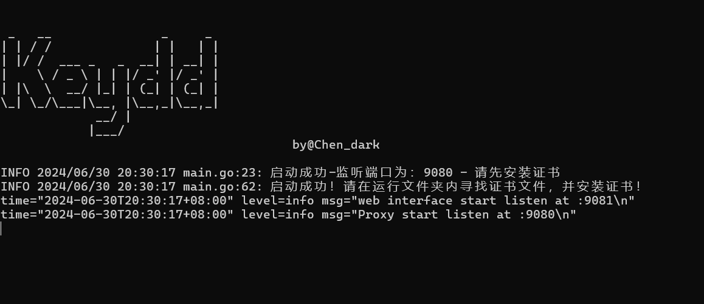

# Keydd
# 一、免责说明

- 本工具仅面向合法授权的企业安全建设行为与个人学习行为，如您需要测试本工具的可用性，请自行搭建靶机环境。
- 在使用本工具进行检测时，您应确保该行为符合当地的法律法规，并且已经取得了足够的授权。请勿对非授权目标进行扫描。

如果发现上述禁止行为，我们将保留追究您法律责任的权利。

如您在使用本工具的过程中存在任何非法行为，您需自行承担相应后果，我们将不承担任何法律及连带责任。

在安装并使用本工具前，请您务必审慎阅读、充分理解各条款内容。

除非您已充分阅读、完全理解并接受本协议所有条款，否则，请您不要安装并使用本工具。您的使用行为或者您以其他任何明示或者默示方式表示接受本协议的，即视为您已阅读并同意本协议的约束。

```
 _   __               _     _ 
| | / /              | |   | |
| |/ /  ___ _   _  __| | __| |
|    \ / _ \ | | |/ _' |/ _' |
| |\  \  __/ |_| | (_| | (_| |
\_| \_/\___|\__, |\__,_|\__,_|
             __/ |            
            |___/
					by@Chen_dark
```


# 二、写在前面

​	一直在使用一些工具插件，来检测流量中的ak、sk、sfz、敏感信息，但是网上的很多工具并不符合自己的习惯...运行起来会影响抓包、测试、卡顿等....

​	遂自己写了一个关于http/https流量中检测工具，可以设置为burp、yakit、爬虫等工具的下游代理，在测试结束后查看流量中的敏感信息

工具优势：

- 在检测敏感信息并且存储中会对uri进行判断，避免同一个uri多次访问而产生多条信息的存在
- 占用内存较少，不会对burp等上游工具造成卡顿影响
- 可以接入爬虫、bp等，对流量中的信息进行匹配检测
- 目前只对Content-Type为text/html、application/json、application/javascript的类型流量进行劫持，大文件、图片信息等不进行劫持。加快检测速度！
- 检测规则依赖于原生wih[WIH 调用 - ARL 资产灯塔系统安装和使用文档 (tophanttechnology.github.io)](https://tophanttechnology.github.io/ARL-doc/function_desc/web_info_hunter/)，目前支持规则的启停、支持用户自定义增加规则。
- exclude_rules-规则排除检测正在开发中.....

# 三、使用说明

运行程序后会在当前路径下生成证书、配置文件、数据库文件

请先安装证书文件-选择受信任根证书颁发机构


​	扫描匹配规则来自于wih:[WIH 调用 - ARL 资产灯塔系统安装和使用文档 (tophanttechnology.github.io)](https://tophanttechnology.github.io/ARL-doc/function_desc/web_info_hunter/)

​	可以自主根据规则添加，目前版本暂不支持规则开启、关闭功能

​	运行后可将127.0.0.1:9080设置为burpsuite下游代理地址或为浏览器的代理地址



​	当在流量检测到敏感信息时会在控制台显示，并且在数据库文件中存储


​	如果需要使用消息提醒功能，请在`rule.yaml`中加入`lark_Webhook`的配置信息（暂时只支持飞书消息提醒）、**为了防止大量发送信息，这里采用了sleep(1s)进行限速！**消息提醒效果如下


