# Keydd


[TOC]


# 一、免责说明

- 本工具仅面向合法授权的企业安全建设行为与个人学习行为，如您需要测试本工具的可用性，请自行搭建靶机环境。
- 在使用本工具进行检测时，您应确保该行为符合当地的法律法规，并且已经取得了足够的授权。请勿对非授权目标进行扫描。

如果发现上述禁止行为，我们将保留追究您法律责任的权利。

如您在使用本工具的过程中存在任何非法行为，您需自行承担相应后果，我们将不承担任何法律及连带责任。

在安装并使用本工具前，请您务必审慎阅读、充分理解各条款内容。

除非您已充分阅读、完全理解并接受本协议所有条款，否则，请您不要安装并使用本工具。您的使用行为或者您以其他任何明示或者默示方式表示接受本协议的，即视为您已阅读并同意本协议的约束。

```
 _   __               _     _ 
| | / /              | |   | |
| |/ /  ___ _   _  __| | __| |
|    \ / _ \ | | |/ _' |/ _' |
| |\  \  __/ |_| | (_| | (_| |
\_| \_/\___|\__, |\__,_|\__,_|
             __/ |            
            |___/
					by@Chen_dark
```


# 二、写在前面

​	一直在使用一些工具插件，来检测流量中的ak、sk、sfz、敏感信息，但是网上的很多工具并不符合自己的习惯...运行起来会影响抓包、测试、卡顿等....

​	遂自己写了一个关于http/https流量中检测工具，可以设置为burp、yakit、爬虫等工具的下游代理，在测试结束后查看流量中的敏感信息

工具优势：

- 在检测敏感信息并且存储中会对uri进行判断，避免同一个uri多次访问而产生多条信息的存在
- 占用内存较少，不会对burp等上游工具造成卡顿影响
- 可以接入爬虫、bp等，对流量中的信息进行匹配检测
- 目前只对Content-Type为text/html、application/json、application/javascript的类型流量进行劫持，大文件、图片信息等不进行劫持。加快检测速度！
- 检测规则依赖于原生wih[WIH 调用 - ARL 资产灯塔系统安装和使用文档 (tophanttechnology.github.io)](https://tophanttechnology.github.io/ARL-doc/function_desc/web_info_hunter/)，目前支持规则的启停、支持用户自定义增加规则。
- exclude_rules-规则排除检测正在开发中.....

# 二、流量过滤与性能优化

## 流量过滤机制

Keydd **仅处理特定的Content-Type**，其他流量类型会被直接跳过，这是保证高效率的关键：

### 处理的内容类型
- **text/html** - HTML页面源码
- **application/json** - JSON接口返回数据
- **application/javascript** - JavaScript代码

### 跳过的内容类型（完全不处理）
- 图片文件 (image/png, image/jpeg, image/gif等)
- CSS样式表 (text/css)
- 字体文件 (font/*)
- 视频/音频 (video/*, audio/*)
- 二进制文件 (application/octet-stream等)
- 压缩包 (application/zip, application/gzip等)

**优势**：通过内容类型过滤，80%+的流量会直接被跳过处理，大幅降低CPU和内存消耗。

## 检测规则

### 启用的检测规则（30种）

Keydd 内置30种敏感信息检测规则，涵盖常见的凭证和密钥：

| 分类 | 规则ID | 检测目标 |
|------|--------|---------|
| **身份信息** | id_card | 中国身份证号 (18位) |
| | phone | 中国手机号 |
| **凭证信息** | jwt_token | JWT令牌 |
| | bearer_token | Bearer认证令牌 |
| | basic_token | HTTP Basic认证 |
| | auth_token | Authorization头凭证 |
| | private_key | PEM格式私钥 |
| **API密钥** | Aliyun_AK_ID | 阿里云AccessKey |
| | QCloud_AK_ID | 腾讯云密钥 |
| | JDCloud_AK_ID | 京东云密钥 |
| | AWS_AK_ID | AWS密钥 |
| | VolcanoEngine_AK_ID | 火山引擎密钥 |
| | Kingsoft_AK_ID | 金山云密钥 |
| | GCP_AK_ID | 谷歌云密钥 |
| **代码平台令牌** | gitlab_v2_token | GitLab token (glpat-*) |
| | github_token | GitHub token (ghp_/gho_/ghu_/ghs_等) |
| **消息平台** | wechat_appid | 微信公众号AppID |
| | wechat_corpid | 企业微信CorpID |
| | wechat_id | 微信公众号ID |
| | wechat_webhookurl | 企业微信Webhook |
| | dingtalk_webhookurl | 钉钉Webhook |
| | feishu_webhookurl | 飞书Webhook |
| | slack_webhookurl | Slack Webhook |
| **监控平台** | grafana_api_key | Grafana API密钥 |
| | grafana_cloud_api_token | Grafana Cloud令牌 |
| | grafana_service_account_token | Grafana服务账号令牌 |
| **其他密钥** | app_key | 应用密钥 |
| | password | 通用密码字段 |
| | secret_key | 通用Secret密钥 |
| | qcloud_api_gateway_appkey | 腾讯API网关key |

### 禁用的检测规则（降低误报）

以下规则因误报率高而默认禁用，需要时可手动启用：
- `domain` - 域名 (通用，易误报)
- `path` - URL路径 (通用，易误报)
- `domain_url` - 完整域名URL (通用)
- `ip` - IP地址 (通用)
- `email` - 邮箱地址 (通用)

### 规则排除（Exclude Rules）

支持对特定域名或规则的排除，避免误报干扰：

```yaml
exclude_rules:
  - name: "不收集 cc.163.com 的 secret_key"
    id: secret_key
    target: regex:cc\.163\.com
    enabled: true
    
  - name: "不收集 open.work.weixin.qq.com 的 bearer_token"
    id: bearer_token
    target: https://open.work.weixin.qq.com
    content: regex:Bearer\s+
    enabled: true
```

---

## 性能优化策略

Keydd 采用多项优化措施，确保在检测敏感信息的同时不对上游工具造成卡顿：

## 1. 智能流式处理（大文件防护）

```
StreamLargeBodies: 20 MB
```

- **机制**：响应体超过 20MB 时，采用流式处理而非一次加载到内存
- **效果**：防止大文件（如视频、压缩包等）导致内存溢出
- **适配**：自动与内容类型过滤配合，进一步保护内存

## 2. 并发处理（非阻塞检测）

```go
// 每个HTTP响应触发一个goroutine
go func() {
    err := cmd.MatchRules(string(body), f)
    // 错误通过缓冲channel异步传递
}()

errChan := make(chan error, 200)  // 允许200个并发错误
```

- **机制**：每个HTTP响应的规则检测在独立goroutine中进行
- **非阻塞**：缓冲channel (容量200) 防止goroutine堵塞
- **效果**：检测不会阻塞HTTP响应返回，上游工具感受不到延迟

## 3. 启动期编译（正则预热）

```go
// 应用启动时，一次性编译所有启用的规则
for _, rule := range config.Rules {
    if !rule.Enabled {
        continue
    }
    regex, err := regexp.Compile(rule.Pattern)
    consts.LodaRules[rule.Id] = regex  // 缓存到map
}
```

- **机制**：正则表达式在启动时编译一次，后续复用
- **效果**：避免每个请求都重新编译正则，减少CPU消耗

## 4. 一次解码（单点解码）

```go
f.Response.ReplaceToDecodedBody()  // 仅调用一次
```

- **机制**：响应体只解码一次，所有规则共用解码结果
- **效果**：减少重复的编解码开销

## 5. 去重检测（避免重复通知）

```
检测key: (Host, Req_Path, RuleName, Key_text)
```

- **机制**：同一个endpoint的同一条规则的同一个凭证只存储一次
- **效果**：避免重复访问造成的通知风暴；数据库和Webhook都不会被重复触发

## 6. 规则启停机制

在 `config/rule.yaml` 中可灵活启停规则：

```yaml
rules:
  - id: jwt_token
    pattern: eyJ[A-Za-z0-9_-]+\.eyJ[A-Za-z0-9_-]+\.[A-Za-z0-9_\-.]*
    enabled: true
    test_cases:
      - "eyJhbGciOiJIUzI1NiIsInR5cCI6IkpXVCJ9..."
```

- **机制**：禁用不需要的规则，减少正则匹配工作量
- **效果**：可根据测试场景定制规则集，进一步优化性能

## 7. 并发限制（通知节流）

```go
// 飞书通知发送时的节流
time.Sleep(1 * time.Second)
```

- **机制**：每条Webhook通知间隔1秒
- **效果**：防止Webhook接收端被消息轰炸；防止被限流

## 性能对比

| 场景 | 优化前 | 优化后 | 提升 |
|------|------|------|------|
| 大文件传输 | 内存溢出/卡顿 | 流式处理，无影响 | ✅ 完全解决 |
| 100请求/秒 | CPU高负载 | 非阻塞处理 | ✅ 显著改善 |
| 重复访问 | 重复通知 | 去重检测 | ✅ 完全消除 |
| 启动延迟 | N/A | <1秒 | ✅ 快速启动 |

---

# 三、使用说明

## 安装

运行程序后会在当前路径下生成证书、配置文件、数据库文件

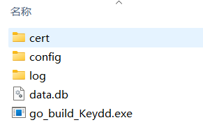

请先安装证书文件-选择受信任根证书颁发机构

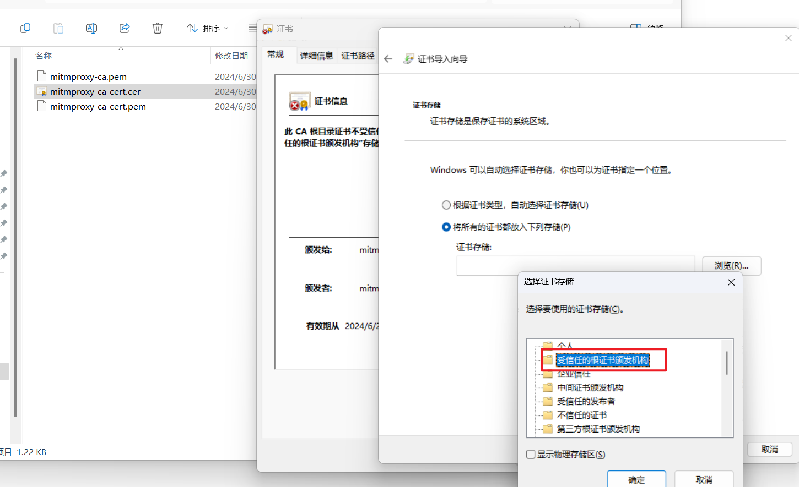

​	扫描匹配规则来自于[WIH](https://tophanttechnology.github.io/ARL-doc/function_desc/web_info_hunter/)，若部分场景、case无检测到，可以自主根据规则添加、调优，方便的师傅可以提一个issue。

​	如果需要使用消息提醒功能，请在`rule.yaml`中加入`lark_Webhook`的[在群组中使用机器人](https://www.feishu.cn/hc/zh-CN/articles/360024984973-在群组中使用机器人)（暂时只支持飞书消息提醒）

## 使用教程

​	运行后会显示默认的端口信息，以及飞书webhook地址。如果需要自定义端口可以看后面的编译说明

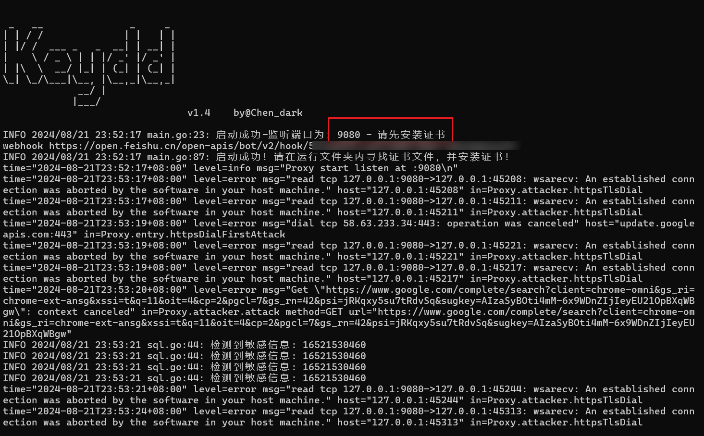

​	可以将127.0.0.1:9080地址设置成BurpSuite、浏览器、爬虫的下游代理地址，具体操作如下

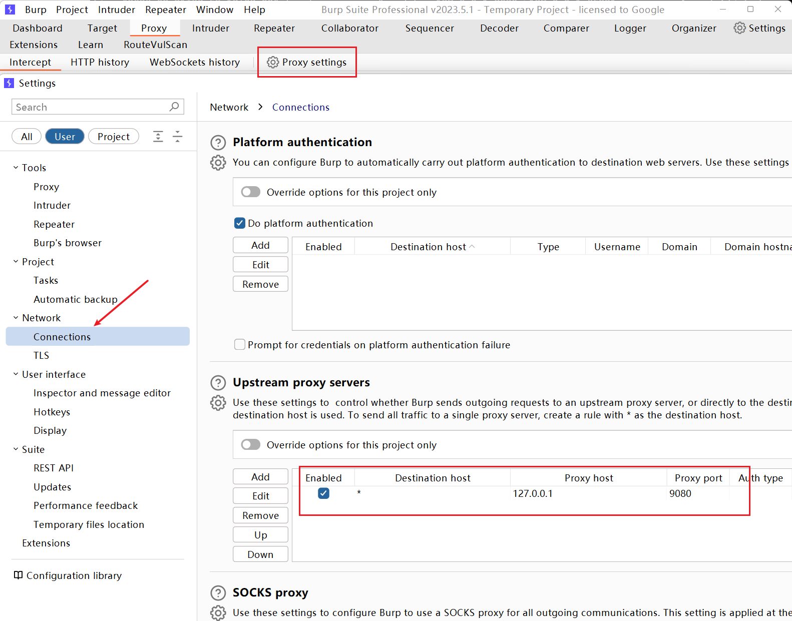

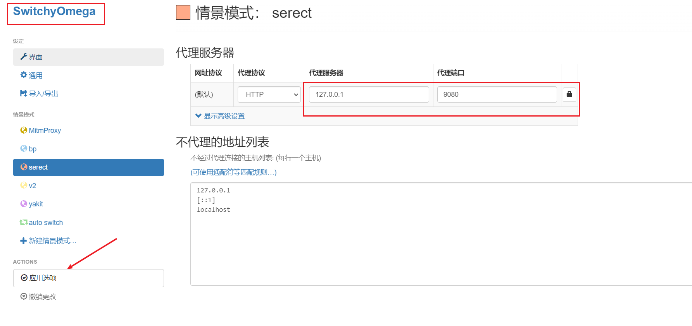		当在流量中的信息匹配到规则的时候，将会在控制台输出，同时也会写入本地db文件。若配置了webhook将会发送消息提醒

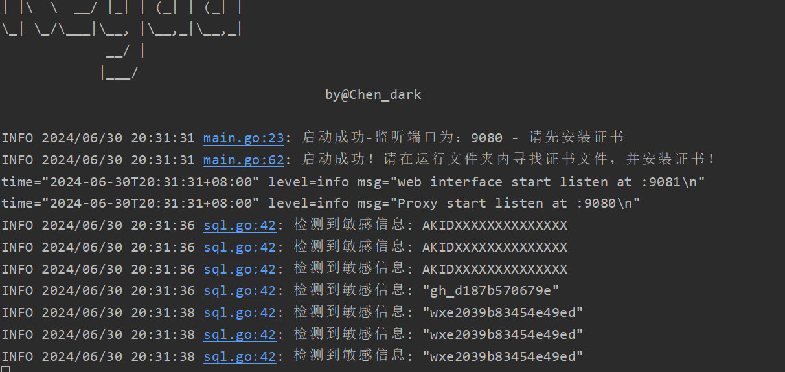

​	在对站点渗透测试结束，可以打开数据库连接工具（navicat）等打开db文件，查看检测到的敏感信息详情。


​	消息提醒效果如下

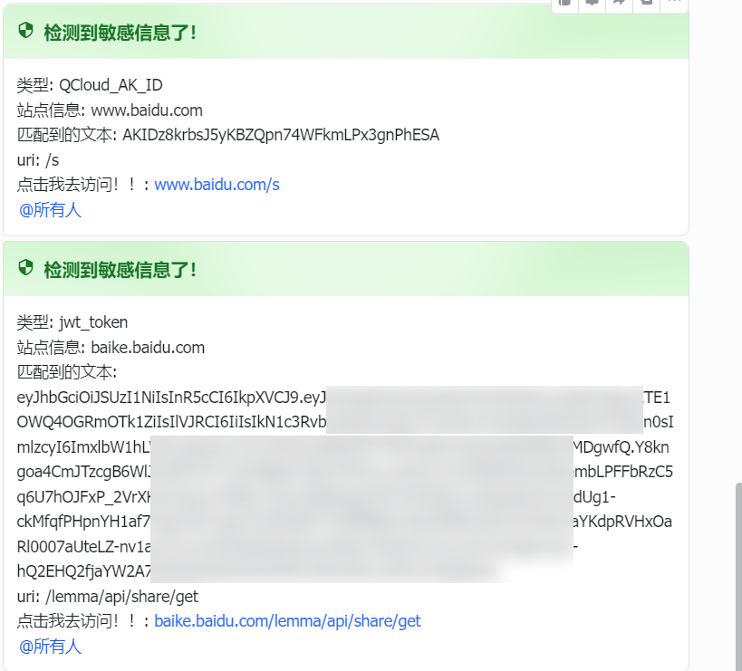

​	关于规则，前面列举的内置规则此工具暂时还不支持，在接下来的版本会做优化和适配。

​	工具支持规则开关，若某个规则产生大量误报可以在`enable`字段进行关闭。

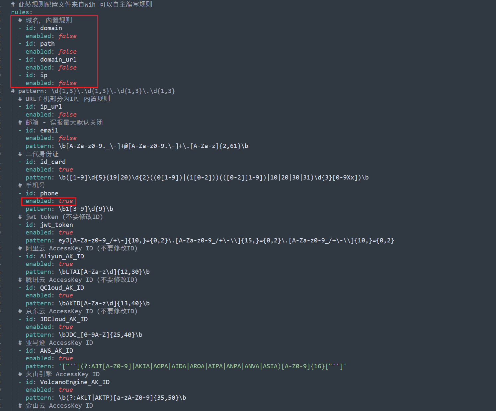

# 四、测试

本项目包含完整的单元测试和集成测试覆盖，确保代码质量和功能正确性。

## 测试运行

在项目根目录运行所有测试：

```bash
go test ./...
```

运行特定测试包：

```bash
go test ./cmd
go test ./notify
go test ./tests/rules
```

## 测试覆盖范围

### 1. 规则验证测试 (`cmd/rule_validator_test.go`)

测试规则配置的有效性和正确性：

- **TestValidateRules_AllPass**: 验证格式正确的规则通过检查（电话号码、JWT令牌等）
- **TestValidateRules_DisabledRuleSkipped**: 禁用的规则跳过验证检查
- **TestValidateRules_InvalidRegex**: 捕获格式错误的正则表达式
- **TestValidateRules_NoTestCase**: 验证规则包含测试用例
- **TestValidateRules_MatchFailed**: 检测测试用例与其模式不匹配
- **TestValidateRules_BuiltinSkip**: 内置规则（domain、path、secret_key、ip）绕过模式和测试用例检查
- **TestValidateRules_NoPattern**: 捕获启用的规则中缺失的模式
- **TestValidateRules_MultipleErrors**: 捕获和报告多个验证错误

### 2. 飞书通知测试 (`notify/feishu_test.go`)

测试敏感信息发现时的通知功能：

- **TestSendmesg**: 测试向飞书Webhook发送通知消息

### 3. 规则引擎和YAML测试 (`tests/rules/runner_test.go`)

综合规则测试基础设施：

- **TestAllRulesFromYAML**: 加载 `testcases.yaml` 和 `rule.yaml`，针对所有规则执行正则匹配测试，报告通过/失败统计
- **TestRuleYAMLSyntax**: 验证 `rule.yaml` 语法和结构可以正确解析
- **TestAllPatternCompilable**: 验证所有启用规则的正则表达式编译无误
- **辅助功能**: 从YAML加载测试用例、从配置加载规则、截断长字符串以显示在错误消息中

## 测试特点

- **YAML驱动测试**: `runner_test.go` 使用独立的 `testcases.yaml` 文件进行规则验证，便于添加新测试用例
- **覆盖范围**: 测试涵盖核心功能——规则验证、规则YAML解析和通知功能
- **代码质量**: 用于确保敏感信息检测准确性

# 五、说明

## :notebook:TODO

- 内置规则支持
- 企业微信、钉钉机器人支持
- 日志存储、输出归一化
- 消息提醒功能优化，避免大量检测出规则导致消息发送失败
- 规则优化
- 从JS、CSS等文件内拼接其他文件、接口路径，进行主动访问
- 支持CSV文件导出
- 检测规则热加载

## Q：问题如何排查

> 出现无法连接？网页显示不全如何进行排查？

​	可以在`log`文件夹下查看日志信息文件，为了防止大量日志打印在控制台，对正常的查看数据造成影响，这里把`error`级别的日志信息保存到日志文件中。

​	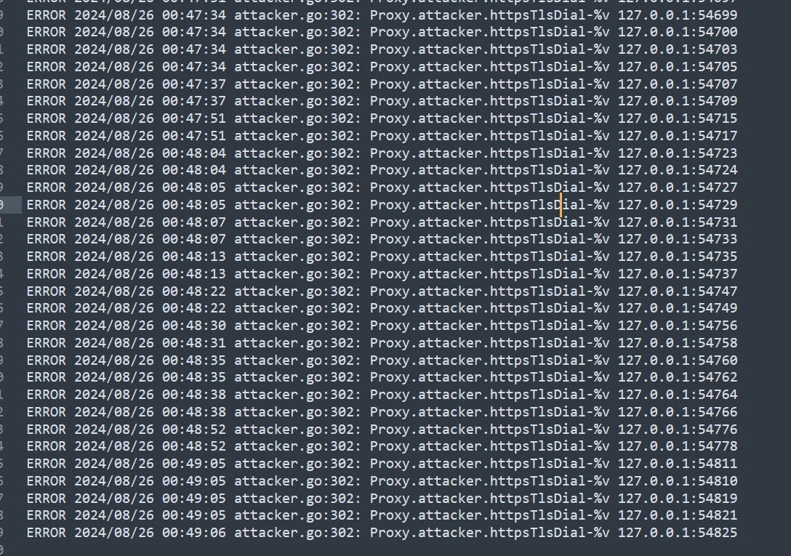

​	出现这种无法连接的，大多是本地ip端口的问题，在不影响正常使用的话无需理会。如果出现google、firebase相关可能为无法翻墙，导致无法连接的报错。

## Q：检测的不全面

>  一些密码、SK为什么某些工具可以检测，这个工具无法检测

​	再好的工具本质都是靠着强大的规则支撑，原生WIH的规则其实是有很多bad case，还有一些场景检测不全，其实还是依靠师傅们共建规则、不断优化。

## Q：~~控制台大量报错信息~~

> 控制台存在大量报错？会影响使用吗
>
> 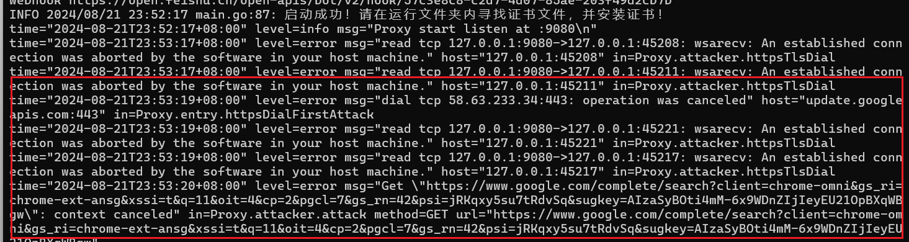

​	~~报错信息很多是本地连接、http请求需要翻墙站点、站点已经关闭无法连接这些原因导致的，如果在web页面可以正常访问的情况下是不影响的。关于日志输出控制台的问题，在后面会优化这个问题。~~

​	v1.4修复了控制台日志过多的问题

​	如果需要查看检测的敏感信息，可以查看`log/info.log`文件中的内容

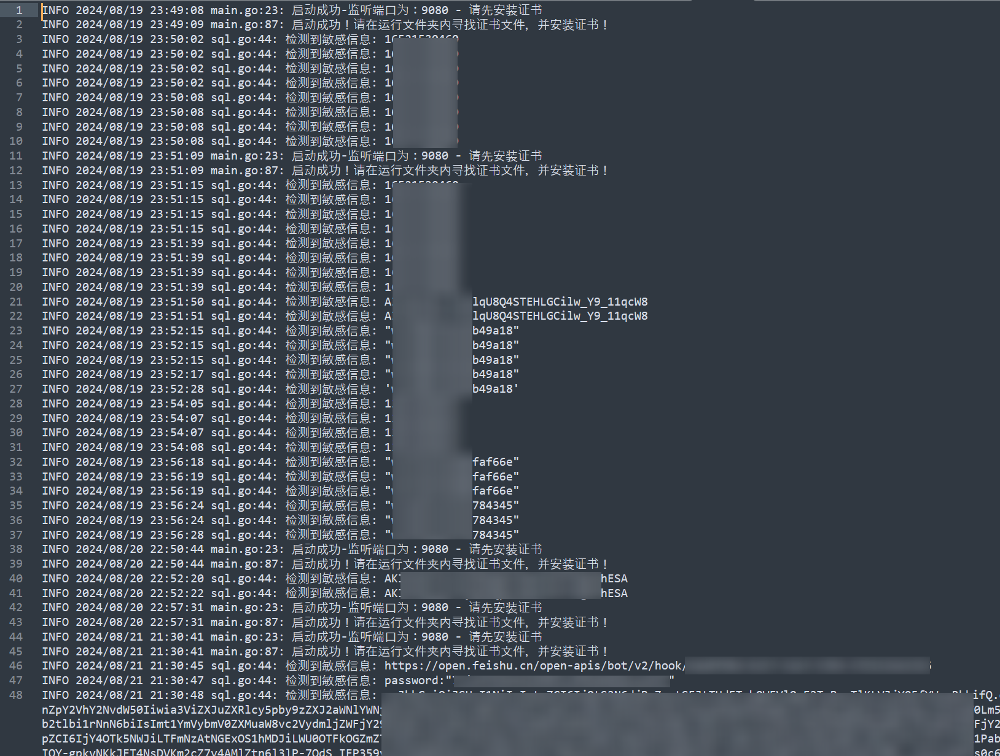

​	控制台可以查看当前站点没响应的原因，例如在burp等其他工具报错的时候可以查看是否为`keydd`出现问题

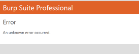

## Q：飞书消息有的时候收不到

​	这种情况可能是短时间内检测到大量的敏感信息，飞书webhook频繁访问，导致接口限流，发送失败。后面会优化代码，采取消息队列、限频等方式优化

# 六、更新日志

## v1.3

- 开源第一个版本

## v1.4

- 修复[lqqyt2423/go-mitmproxy](https://github.com/lqqyt2423/go-mitmproxy)包日志全局输出，导致控制台无用信息过多
- 部分`error`级别日志信息保存在`log`目录，控制台上不输出
- 为了方便修改，将[lqqyt2423/go-mitmproxy](https://github.com/lqqyt2423/go-mitmproxy)包拉取本地
- 完善检测规则的某个case

# Star History

[](https://star-history.com/#YouChenJun/Keydd&Date)

​	最后，欢迎师傅们使用，提issue！


