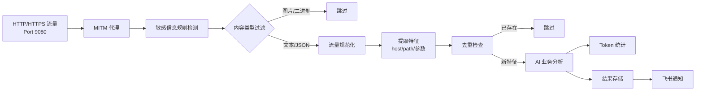

# Keydd


[English](#) | [中文](#)

# 一、免责说明

- 本工具仅面向合法授权的企业安全建设行为与个人学习行为，如您需要测试本工具的可用性，请自行搭建靶机环境。
- 在使用本工具进行检测时，您应确保该行为符合当地的法律法规，并且已经取得了足够的授权。请勿对非授权目标进行扫描。

如果发现上述禁止行为，我们将保留追究您法律责任。

如您在使用本工具的过程中存在任何非法行为，您需自行承担相应后果，我们将不承担任何法律及连带责任。

在安装并使用本工具前，请您务必审慎阅读、充分理解各条款内容。

除非您已充分阅读、完全理解并接受本协议所有条款，请不要安装并使用本工具。您的使用行为或者您以其他任何明示或者默示方式表示接受本协议，即视为您已阅读并同意本协议的约束。

```
 _   __               _     _
| | / /              | |   | |
| |/ /  ___ _   _  __| | __| |
|    \ / _ \ | | |/ _' |/ _' |
| |\  \  __/ |_| | (_| | (_| |
\_| \_\___|\__, |\__,_|\__,_|
             __/ |
            |___/
                by@Chen_dark
```

# 二、项目简介

Keydd 是一个**基于 mitmproxy 思路的 HTTP(s) 流量敏感信息检测工具**，可以作为 BurpSuite、爬虫、浏览器的下游代理，在流量经过时自动检测其中的敏感信息（AK/SK、密码、JWT 等），并支持 **AI 驱动的 API 业务逻辑分析**。

## 核心功能

| 功能 | 说明 |
|------|------|
| **敏感信息检测** | 30+ 内置规则，覆盖 AK/SK、JWT、密码、Webhook 等 |
| **AI 业务分析** | LLM 驱动的 API 接口业务逻辑分析 |
| **数据库持久化** | SQLite/MySQL/PostgreSQL 多数据库支持 |
| **可观测性** | Langfuse 追踪、Token 统计、速率限制 |

## 架构流程图


```mermaid
flowchart LR
    A[HTTP/HTTPS 流量<br/>Port 9080] --> B[MITM 代理]
    B --> C[敏感信息规则检测]
    C --> D{内容类型过滤}
    D -->|图片/二进制| E[跳过]
    D -->|文本/JSON| F[流量规范化]
    F --> G[提取特征<br/>host/path/参数]
    G --> H[去重检查]
    H -->|已存在| I[跳过]
    H -->|新特征| J[AI 业务分析]
    J --> K[Token 统计]
    J --> L[结果存储]
    L --> M[飞书通知]
```

# 三、快速开始

## 安装

```bash
go build -o keydd main.go
./keydd
```

首次运行会自动生成证书和配置文件。

## 配置

编辑 `config/rule.yaml` 配置敏感信息检测规则，配置示例：

```yaml
# AI 功能配置
ai:
  enabled: true
  llm:
    model: gpt-4o-mini
    api_key: "sk-xxx"  # 或通过 OPENAI_API_KEY 环境变量
    base_url: "https://api.openai.com/v1"
```

## 使用

将 Keydd (`127.0.0.1:9080`) 设置为下游代理：

- **BurpSuite** → Settings → Network → Connections → Upstream Proxy Server
- **浏览器** → System Proxy

# 四、检测规则

## 内置规则（30+）

| 分类 | 检测目标 |
|------|---------|
| 身份信息 | 身份证号、手机号 |
| 凭证信息 | JWT、Bearer Token、Basic 认证、私钥 |
| API 密钥 | 阿里云、腾讯云、火山引擎、AWS、GCP 等 |
| 代码平台 | GitLab Token、GitHub Token |
| 消息平台 | 微信、企业微信、钉钉、飞书、Slack Webhook |
| 其他 | 通用密码、Secret Key |

## 自定义规则

在 `config/rule.yaml` 中添加：

```yaml
rules:
  - id: my_custom_rule
    pattern: your-regex-pattern
    enabled: true
```

# 五、性能优化

| 优化 | 说明 |
|------|------|
| **内容类型过滤** | 跳过图片/CSS/字体/二进制，只处理文本 |
| **流式大文件处理** | 超过阈值流式处理，不占满内存 |
| **非阻塞并发** | 检测在独立 goroutine，不阻塞代理 |
| **启动预编译正则** | 所有正则启动编译一次 |
| **去重检测** | 同一凭证同一端点只存一次 |

# 六、数据存储

| 数据库 | 用途 |
|--------|------|
| **主数据库** | 敏感信息检测结果 |
| **AI 数据库** | Token 统计、分析记录 |

支持 SQLite（默认）、MySQL、PostgreSQL。

# 七、更新日志

## v2.0

- 重构 AI 模块，简化架构
- 新增 Token 追踪和速率限制器
- 新增分析指标系统
- 支持 Memory Service（Redis/InMemory）
- 集成 Langfuse 可观测性
- 数据库持久化优化

## v1.4

- 修复控制台日志过多问题
- error 级别日志写入文件

## v1.3

- 开源第一个版本

# Star History

[](https://star-history.com/#YouChenJun/Keydd&Date)

欢迎提 Issue 和 PR！
